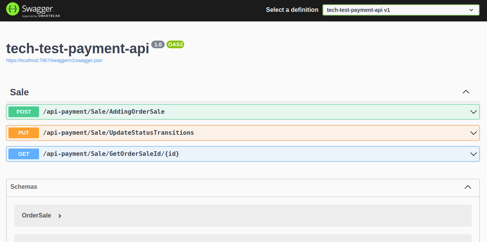

# Task Manager

<p align="center">
    
</p>

<p align="center">
    
    
    
    
    
</p>

## About:

Development of a restful api application performing operations for the sales sector.

Being organized by salespeople, products and sales made, all salespeople have specific products, where the last task (sale) will be performed and monitored by the customer, but there is no form of authentication, we only use the logic for the test.

## Layout:



Image result can be seen on my linkedin - publications:
[mateusmaciel340](https://www.linkedin.com/in/mateusmaciel340/)

## How to run the project?

The steps to access the project are very simple, but follow in the following order:

```bash
docker-compose up -d #01

build dotnet #02

dotnet-ef migrations add MigrationsInitial #03

dotnet-ef database update #04

dotnet watch run #05
```

## Technologies

The following tools were used in building the project:

### Backend (C#)

- C#
- .Net
- Docker
- EntityFramework
- SqlServer

## Contributors

<table>
    <thead>
        <tr>
            <td>
                
            </td>
        </tr>
    </thead>
    <tbody>
        <tr>
            <th>Mateus Maciel</th>
        </tr>
    </tbody>
</table>

## How to contribute?

1. Fork the project.
2. Create a new branch with your changes: `git checkout -b my-feature`
3. Save the changes and create a commit message telling what you did: `git commit -m Modifying this [...]`
4. Submit your changes: `git push origin my-feature`

## License

This project is under license [MIT](https://github.com/git/git-scm.com/blob/main/MIT-LICENSE.txt).